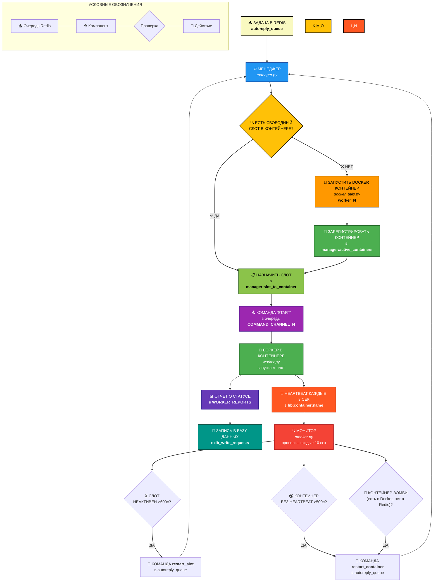

# RedTailFox Orchestrator 🦊

<p align="center">
  
  
  
  
</p>

<p align="center">
  <b>EN:</b> Lightweight Python orchestration over Docker & Redis •  
  <b>RU:</b> Легковесная оркестрация Python-воркеров •  
  <b>中文:</b> 基于 Docker 和 Redis 的轻量级 Python 编排
</p>

<p align="center">
  <i>Kubernetes — для космоса. RedTailFox — для вашего сервера.</i><br>
  <i>Kubernetes is for space. RedTailFox is for your server.</i>
</p>

---

## 🎯 Зачем это?

**Если коротко:** Kubernetes слишком жирный, Celery не умеет управлять контейнерами, а вручную поднимать 100 Docker-контейнеров и следить за ними — боль.

**RedTailFox** — это ровно тот слой оркестрации, который нужен, когда у вас:
- Много однотипных воркеров (боты, парсеры, автоответчики)
- Каждый воркер — отдельный аккаунт/задача со своим конфигом
- Нужно, чтобы система чинила себя сама
- Нет отдельного DevOps, но хочется жить спокойно

---

## 🔥 Возможности

| Feature | Description |
|---------|-------------|
| **Умные слоты** | Менеджер распределяет задачи по слотам внутри контейнеров |
| **Автомасштабирование** | При нехватке слотов автоматически поднимаются новые Docker-контейнеры |
| **Автовосстановление** | Монитор проверяет heartbeat'ы и перезапускает упавшие слоты/контейнеры |
| **Graceful shutdown** | Воркеры корректно завершаются и отписываются от менеджера |
| **Хранение конфигов в Redis** | Слот можно перезапустить даже без внешних данных |
| **Мониторинг через HeadBear** | Своя легкая система метрик (опционально) |
| **Никакого YAML** | Всё настраивается переменными окружения и Python-словарями |

---

## 🏗 Как это работает



### Компоненты системы

| Компонент | Что делает | Где лежит |
|-----------|------------|-----------|
| **Менеджер** | Распределяет задачи, управляет контейнерами, хранит состояние в Redis | `manager/main.py` |
| **Воркер** | Живет в Docker, запускает слоты, шлет heartbeat | `worker/main.py` |
| **Монитор** | Следит за здоровьем, инициирует рестарты | `monitor/monitor.py` |
| **HeadBear** | Собирает метрики по слотам и контейнерам | `worker/heartbeat.py` |

---

## 🚀 Быстрый старт за 5 минут

### 1. Подготовка

```bash
# Клонируем
git clone https://github.com/yourname/redtailfox-orchestrator
cd redtailfox-orchestrator

# Ставим зависимости
pip install -r requirements.txt

# Настраиваем окружение
cp .env.example .env
# Отредактируйте .env под свой Redis
```

### 2. Собираем образ воркера

```bash
docker build -t rtf-worker:latest -f worker/Dockerfile .
```

### 3. Запускаем менеджера

```bash
python manager/main.py
```

### 4. В отдельном терминале запускаем монитор

```bash
python monitor/monitor.py
```

### 5. Отправляем первую задачу

```python
import redis, json

r = redis.Redis(host='localhost', port=6379)

task = {
    "command": "start",
    "slot_id": 1,
    "config": {
        "bot": {
            "username": "my_bot",
            "check_interval": 300
        }
    }
}

r.lpush("autoreply_queue", json.dumps(task))
print("Задача отправлена!")
```

Через несколько секунд менеджер поднимет контейнер и запустит слот.

---

## 📊 Мониторинг и метрики

Каждый воркер пишет heartbeat в Redis:

```json
{
  "container": "rtf_worker_1",
  "ts": 1678901234,
  "slots": [
    {
      "slot_id": 1,
      "running": true,
      "status": "IDLE",
      "last_active": 1678901200
    }
  ]
}
```

Монитор читает эти ключи и принимает решения:
- Если `ts` старее `HEARTBEAT_TIMEOUT` → рестарт контейнера
- Если слот неактивен больше `SLOT_IDLE_TIMEOUT` → рестарт слота
- Если контейнер есть в `ACTIVE_CONTAINERS_KEY`, но heartbeat отсутствует → рестарт

---

## 🧪 Реальный пример: Instagram-автоответчик на 1000+ воркеров

Мы используем RedTailFox как ядро для коммерческого продукта — автоответчика в Instagram.

**Как это работает:**
- Каждый слот = отдельный Instagram-аккаунт
- Слот проверяет входящие, отвечает по настроенным шаблонам
- HeadBear собирает метрики по каждому аккаунту
- Монитор следит, чтобы все работало 24/7
- При падении аккаунта/контейнера — автоперезапуск

**Результат:** один сервер держит 1000+ одновременных воркеров без Kubernetes.

[Подробнее в примере →](./examples/instagram_autoreply)

---

## ⚙️ Конфигурация

Основные переменные окружения (полный список в [.env.example](.env.example)):

| Переменная | По умолчанию | Описание |
|------------|--------------|----------|
| `REDIS_HOST` | localhost | Хост Redis |
| `REDIS_PORT` | 6379 | Порт Redis |
| `MAX_SLOTS_PER_CONTAINER` | 10 | Максимум слотов в одном контейнере |
| `WORKER_IMAGE` | rtf-worker:latest | Docker-образ воркера |
| `HEARTBEAT_TIMEOUT` | 500 | Таймаут heartbeat (сек) |
| `SLOT_IDLE_TIMEOUT` | 600 | Таймаут простоя слота (сек) |
| `WORKER_TASKS_LIST` | autoreply_queue | Очередь задач для менеджера |

---

## 🧩 Структура проекта

```
redtailfox-orchestrator/
├── manager/          # Менеджер (распределение задач)
├── worker/           # Воркер (исполнение, heartbeat)
├── monitor/          # Монитор (автовосстановление)
├── common/           # Общие модули (redis, константы)
├── docs/             # Документация
├── examples/         # Примеры использования
├── .env.example      # Шаблон конфига
└── README.md         # Этот файл
```

---

## 🤝 Как участвовать

Нам нужна помощь с:
- Тестами (особенно интеграционными)
- Документацией на английском и китайском
- Поддержкой большего количества хостов (сейчас только одна нода)
- Метриками в Prometheus

Смотри [CONTRIBUTING.md](docs/CONTRIBUTING.md) и смело создавай issue/pull request.

---

## 📄 Лицензия

MIT © 2025 RedTailFox Team

---

## 📞 Контакты

- Telegram: [@rtf_labs](https://t.me/rtf_labs)
- GitHub: [github.com/yourname/redtailfox-orchestrator](https://github.com/yourname/redtailfox-orchestrator)

---

<p align="center">
  <b>Сделано с 🦊 и любовью к Python</b>
</p>
